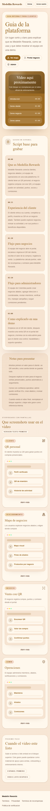
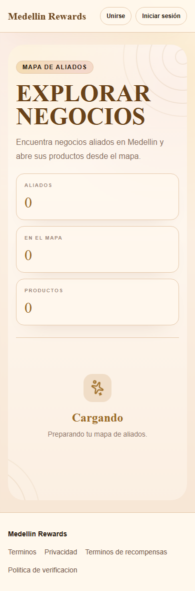
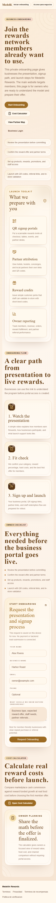
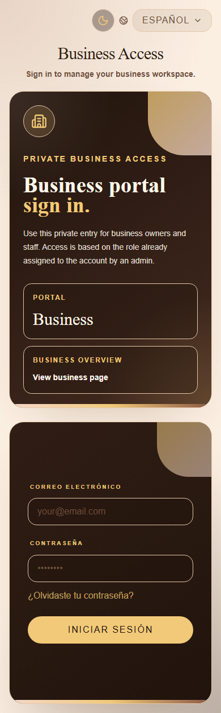
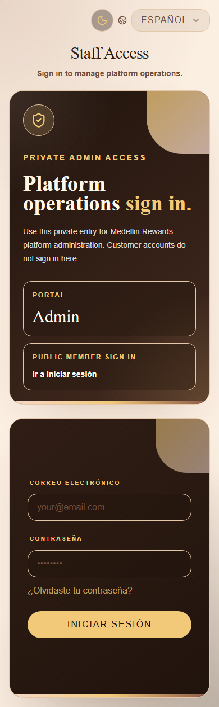

# Guatemala Rewards Walkthrough Summary for Spanish Translation

Purpose: this is the translation-ready walkthrough for all user types. It covers the current public, customer, business staff, business owner, and admin workflows, including the new QR-first customer flow.

Important product framing:

- The customer experience starts with the customer's own Member QR.
- Business staff scan the Member QR to record in-person purchases and assign points.
- Guatemala Rewards tracks the commission owed from recorded QR sales.
- Catalog, rewards, gift card, and commerce features still exist, but the main demo should lead with QR.

## Photo Index

Use these available screenshots in the translated guide:

Photos to capture during a seeded authenticated demo:

- Customer dashboard: `/dashboard`
- Customer profile with active Member QR: `/profile`
- Customer ID verification section: `/profile#id-verification`
- Customer activity: `/activity`
- Customer gift cards: `/gift-cards`
- Customer wallet gift cards: `/wallet/gift-cards`
- Business QR sales dashboard: `/business/dashboard`
- Business scanned member sale: `/business/member-sale/:token`
- Business transactions and gift card redemption: `/business/redemptions`
- Business customers: `/business/members`
- Business partners: `/business/partners`
- Admin members: `/admin/portal#members`
- Admin partners: `/admin/portal#partners`
- Admin commissions: `/admin/portal#commissions`

## Recommended Demo Story

1. Open the public guide and explain the three-sided platform: customers, partner businesses, and operations.
2. Show the customer journey: sign in, verify ID, activate Member QR, show QR, review activity.
3. Show the business journey: scan customer QR, enter purchase amount, process with or without a gift card, see points and commission.
4. Show the admin journey: approve customers, manage partners, review activity, and mark commission paid.
5. Close with the business model: QR sale creates points for the customer and commission tracking for Guatemala Rewards.

## Public Visitor Workflow

### Platform Guide

Route: `/guide`

Photo: `../public/walkthrough-screenshots/guide.png`

Steps:

1. Open the guide page.
2. Explain that Guatemala Rewards connects members, partner businesses, and the operations team.
3. Show the video placeholder and storyboard sections.
4. Use the guide as the main training script for demos.
5. Mention that the same guide is available inside business and admin portals.

### Partner Business Map

Route: `/shop`

Photo: `../public/walkthrough-screenshots/public-map.png`

Steps:

1. Open the partner map.
2. Browse partner businesses.
3. Select a business from the map or list.
4. Review address, map status, and available products when present.
5. Explain that customers use this to choose where to shop or earn rewards.

### Business Landing Page

Route: `/business`

Photo: `../public/walkthrough-screenshots/business-page.png`

Steps:

1. Open the business page.
2. Explain the value for businesses: customers bring a Member QR, staff record purchases, and points are assigned automatically.
3. Show the business login entry.
4. Show the cost calculator entry.
5. Explain that this page is for business onboarding and sales conversations.

### Cost Calculator

Routes: `/cost-calculator`, `/business/cost-calculator`

Steps:

1. Open the calculator.
2. Enter example business assumptions.
3. Use the result to explain potential rewards value and partner economics.
4. Use this in sales conversations before a business joins.

### Public Promotions

Route: `/promotions`

Steps:

1. Open promotions.
2. Review active campaigns from partner businesses.
3. Explain that campaigns help customers decide where to shop.
4. Clarify that promotions are discovery content; QR sales are recorded separately by staff.

### Join, Invitation, and Early Access

Routes: `/`, `/invitation`, `/join`, `/early-access`, `/joinusearly`, `/join-us-early`

Steps:

1. Open the invitation or join flow.
2. Explain that these routes collect interest and guide new users into onboarding.
3. Mention that older join URLs redirect to the invitation flow.

### Referral and Promo Registration

Routes: `/promo`, `/promo/register`

Steps:

1. Open a promo or referral link.
2. Register a customer through the promo flow.
3. Explain that referral context can be preserved for later attribution.
4. Mention that admins and businesses can review referral outcomes.

### Ambassador Page

Route: `/ambassadors`

Steps:

1. Open the ambassador page.
2. Explain that creator or promoter leads are collected here.
3. Explain that admins follow up from the admin portal.

### Public Gift Card Link

Route: `/g/:publicToken`

Steps:

1. Open a public gift card link.
2. Review the gift card display and public sharing view.
3. Explain that business staff redeem gift cards from the business portal.

### Legal Pages

Routes: `/terms`, `/privacy`, `/reward-terms`, `/verification-policy`

Steps:

1. Open each legal page.
2. Explain that agreements and policies support account, reward, and verification workflows.
3. Explain that some signed agreement status is visible to admins.

## New Customer Workflow

This is the most important customer walkthrough. Lead with the Member QR, not the rewards shop.

### Customer Sign In and Agreement Gate

Routes: `/signin`, `/agreements/required`

Steps:

1. Customer opens `/signin`.
2. Customer signs in or creates an account.
3. If required agreements are pending, customer reviews and signs them.
4. After agreements are complete, customer lands on `/dashboard`.

### Customer Dashboard

Route: `/dashboard`

Photo to capture: customer dashboard.

Steps:

1. Show the membership banner if present.
2. Show the verification notice.
3. Show the onboarding checklist:
   - Account created.
   - Verify ID.
   - Unlock Member QR.
   - Make first QR sale.
   - Review activity.
4. Show wallet summary: points, credits, gift cards, and available reward value.
5. Show quick actions:
   - Show member QR.
   - Verify ID.
   - View history.
6. Show recent activity.

### Mobile Customer Navigation

Visible on phone browsers.

Steps:

1. Show the bottom navigation.
2. Explain the four primary mobile actions:
   - Home.
   - Businesses.
   - QR.
   - Activity.
3. Show the verification status strip above the nav.
4. Tap the status strip to open ID verification when needed.
5. Explain that the mobile app experience is designed to work from the phone browser.

### Profile and Member QR

Route: `/profile`

Photo to capture: customer profile with active Member QR.

Steps:

1. Open Profile.
2. Show member status.
3. Show the Member QR area.
4. If the customer is verified, show the active QR code.
5. Use Copy QR Link if staff need the link manually.
6. Explain that businesses scan this QR to open the member sale screen.
7. If the customer is not verified, show the locked QR state.
8. Update profile fields:
   - Full name.
   - Phone number.
   - Home business or location.
   - Favorite order.
9. Save changes.

### ID Verification

Route: `/profile#id-verification`

Photo to capture: ID verification form.

Steps:

1. Open the ID verification section.
2. Enter the verification ID number.
3. Upload a photo or PDF of the ID.
4. Submit the verification.
5. Explain statuses:
   - Required.
   - Submitted or under review.
   - Verified.
   - Rejected or needs resubmission.
6. Explain that earning points, redeeming value, issuing gift cards, and activating the Member QR depend on verification.

### Earning Points With QR

Customer side:

1. Customer opens Profile.
2. Customer shows the Member QR to staff.
3. Staff scans the QR and records the purchase.
4. Customer points are awarded automatically.
5. Customer opens Activity to confirm the transaction.

Business side:

1. Staff scans the Member QR.
2. Staff enters purchase amount.
3. The platform calculates reward value, points awarded, and commission owed.
4. Staff records the sale.

### Partner Businesses

Route: `/shop`

Photo: `../public/walkthrough-screenshots/public-map.png`

Steps:

1. Open Businesses.
2. Browse or search partner businesses.
3. Select a business.
4. Review business details and map placement.
5. Review products when available.
6. Explain that customers can discover where to shop, but QR remains the primary in-person reward flow.

### Promotions

Route: `/promotions`

Steps:

1. Open Promotions.
2. Browse active partner campaigns.
3. Explain that campaigns can motivate visits and purchases.
4. Explain that campaign management happens in business owner or admin tools.

### Cart, Checkout, and Orders

Routes: `/cart`, `/checkout`, `/order-confirmation`, `/orders`

Steps:

1. From a product-enabled business, add an item to the cart.
2. Open Cart.
3. Review quantities and remove items if needed.
4. Continue to Checkout.
5. Review checkout summary and simulated payment method.
6. Apply available credits if allowed.
7. Place the order.
8. Review Order Confirmation.
9. Open Orders to review order history.
10. Explain that checkout is a demo commerce flow and the QR sale flow remains the main in-person workflow.

### Membership

Route: `/membership`

Steps:

1. Open Membership.
2. Review monthly membership details.
3. Subscribe in demo mode when eligible.
4. Renew or cancel membership when available.
5. Explain that verification can lock some reward value actions.

### Gift Cards

Routes: `/gift-cards`, `/wallet/gift-cards`, `/wallet/gift-cards/:id`

Photo to capture: customer gift cards and wallet screens.

Steps:

1. Open Gift Cards.
2. Browse available partner gift cards.
3. Issue a gift card when eligible.
4. Open Wallet Gift Cards.
5. Select a gift card detail page.
6. Copy or share the public gift card link.
7. Show the gift card display or QR.
8. Explain that business staff redeem gift cards from the business Transactions page.
9. Explain that gift cards reduce the customer total, but rewards are still based on the eligible bill before tax and service charge.

### Activity

Route: `/activity`

Photo to capture: customer activity page.

Steps:

1. Open Activity.
2. Review points earned, redemptions, and account updates.
3. Confirm that QR visits and points appear in the timeline.
4. Use this as the customer's proof that purchases are connected to the account.

### Hidden Customer Reward Routes

Routes: `/rewards`, `/redeem/:rewardId`

Current behavior:

1. These routes exist but are hidden from the current customer navigation.
2. Customers are redirected away from them in the current QR-first flow.
3. Explain to the Spanish team that the current public customer copy should prioritize Member QR, not the rewards shop.

## Business Staff Workflow

### Business Login

Route: `/business/login`

Photo: `../public/walkthrough-screenshots/business-login.png`

Steps:

1. Staff opens business login.
2. Staff signs in.
3. Staff lands on the QR Sales dashboard.
4. Staff sees operational tools only.

Staff-accessible routes:

- `/business/dashboard`
- `/business/member-sale/:token`
- `/business/redemptions`
- `/business/members`
- `/business/partners`
- `/business/guide`

Staff does not access owner-only setup pages:

- Products.
- Rewards.
- Promotions.
- Gift card catalog setup.
- Settings.

### QR Sales Dashboard

Route: `/business/dashboard`

Photo to capture: business dashboard.

Steps:

1. Show Customer QR Sales.
2. Explain commission model.
3. Review metrics:
   - Members recruited.
   - Orders completed.
   - Business revenue.
   - Active campaigns.
   - Partner referrals.
   - Partner credits.
   - Outstanding credits.
   - QR transactions.
   - QR revenue.
   - Commission owed.
   - Pending fulfillment.
4. Show points issued and points redeemed.
5. Show the signup portal QR for new customers.
6. Show the reward credit scanner.
7. Show partner referrals and fulfillment queue.

### Record Member Sale

Route: `/business/member-sale/:token`

Photo to capture: scanned member sale page.

Steps:

1. Staff scans the customer's Member QR.
2. The member sale page opens.
3. Staff confirms the member name and verification status.
4. Staff enters purchase amount.
5. Staff adds optional receipt or cashier note.
6. Staff reviews:
   - Reward rate.
   - Reward value.
   - Points awarded.
   - Commission owed.
7. Staff clicks Record Sale.
8. The transaction is recorded.
9. Customer points and commission tracking update.

### Transactions and Gift Card Redemption

Route: `/business/redemptions`

Steps:

1. Open Transactions.
2. For a normal sale, scan or paste the customer's Member QR.
3. Enter the bill before tax and service charge.
4. Enter the receipt or bill number.
5. Review reward value, points awarded, tax, service charge, customer total, and commission.
6. Click Process Without Gift Card.
7. For a gift-card sale, scan, upload, paste, or enter the gift card code/public URL.
8. Validate the gift card.
9. Confirm the preview:
   - Gift card discount reduces the customer total.
   - Tax is added only when the business setting says it is charged to the customer.
   - Service charge is added only when enabled.
   - Points are based on the bill before tax and service charge.
10. Click Process With Gift Card.
11. Click New Transaction for the next customer.
12. Review Transaction History for receipt, customer, total, gift-card discount, final price, points, and gift-card code.

### Customers

Route: `/business/members`

Steps:

1. Open Customers.
2. Search or filter members.
3. Review customer details.
4. Award points manually when needed.
5. Register a new customer from the business portal.
6. Explain that manual tools exist, but QR sale is preferred.

### Partners

Route: `/business/partners`

Steps:

1. Open Partners.
2. Copy ambassador or referral links.
3. Add receptionist or partner contact codes.
4. Review attributed customers.
5. Review outstanding partner credits.
6. Mark partner credits redeemed when appropriate.

### Business Guide

Route: `/business/guide`

Steps:

1. Open Guia from the business portal.
2. Use it as staff training material.
3. Focus the training on QR sales, redemptions, customers, and partner referrals.

## Business Owner Workflow

Business owners can use every staff workflow plus owner-only management features.

### Owner Login and Dashboard

Route: `/business/login`, then `/business/dashboard`

Steps:

1. Owner signs in through business login.
2. Owner sees the full business navigation.
3. Owner reviews QR sales, points, commissions, signup QR, transactions, partners, and performance metrics.

### Products

Route: `/business/products`

Steps:

1. Open Products.
2. Search products.
3. Create a product.
4. Enter title, description, category, price, inventory, and highlight.
5. Save.
6. Edit or delete products.

### Rewards Catalog

Route: `/business/rewards`

Steps:

1. Open Rewards.
2. Search rewards.
3. Create a reward.
4. Enter title, description, category, points cost, inventory, and highlight.
5. Save.
6. Edit or delete rewards.

### Promotions

Route: `/business/promotions`

Steps:

1. Open Promotions.
2. Search campaigns.
3. Create a campaign.
4. Enter title, description, badge, call to action, and audience.
5. Save.
6. Edit or delete promotions.

### Business Gift Card Catalog

Route: `/business/gift-cards`

Steps:

1. Open Gift Cards.
2. Create a gift card catalog item.
3. Enter title, description, value, and availability details.
4. Save.
5. Edit or delete gift card catalog items.
6. Explain that customers issue these gift cards and staff redeem them from Transactions.

### Settings

Route: `/business/settings`

Steps:

1. Open Settings.
2. Review business details.
3. Update owner-editable business information.
4. Review Rewards Rate.
5. Review tax settings:
   - If tax is not charged, leave tax off.
   - If tax is charged to the customer, turn on tax included in customer bill.
6. Review service charge settings if the business uses service charge.
7. Save changes.
8. Explain that rewards are based on the bill before tax and service charge.
9. Explain that deeper platform access assignment is handled by admin.

## Admin Workflow

### Admin Login

Route: `/admin`

Photo: `../public/walkthrough-screenshots/admin-login.png`

Steps:

1. Admin opens `/admin`.
2. Admin signs in.
3. Admin lands on `/admin/portal`.

### Admin Navigation

Admin routes:

- `/admin/portal`
- `/admin/gift-cards`
- `/admin/guide`

Admin portal sections:

- Members.
- Catalog.
- Products.
- Promotions.
- Partners.
- Ambassadors.
- Early Access.
- Referrals.
- Agreements.
- Activity.
- Commissions.

### Members and ID Verification

Route: `/admin/portal#members`

Photo to capture: members section.

Steps:

1. Open Members.
2. Search members.
3. Filter by verification status.
4. Review member profile details.
5. Award points with a reason.
6. Use reward credit when applicable.
7. Review submitted ID verification.
8. Approve verification.
9. Reject verification with a reason.
10. Explain that approval activates the customer QR and unlocks reward value actions.

### Catalog, Products, and Promotions

Routes:

- `/admin/portal#catalog`
- `/admin/portal#products`
- `/admin/portal#promotions`

Steps:

1. Select a partner business.
2. Search existing items.
3. Create rewards, products, or promotions.
4. Enter required item details.
5. Save changes.
6. Edit or delete existing items.

### Partners

Route: `/admin/portal#partners`

Photo to capture: partners section.

Steps:

1. Open Partners.
2. Create a partner business.
3. Enter name, slug, description, address, coordinates, logo URL, reward rate, commission rate, tax rate, tax-included setting, service charge setting, currency, active status, and optional owner email.
4. Save the partner.
5. Search partners.
6. Filter by active, inactive, pinned, missing coordinates, or missing owner.
7. Edit partner details.
8. Assign business owner.
9. Add business staff.
10. Explain that this controls partner visibility and access.

### Ambassadors and Early Access

Routes:

- `/admin/portal#ambassadors`
- `/admin/portal#early-access`

Steps:

1. Review ambassador leads.
2. Update lead status.
3. Review early access leads.
4. Update lead status.
5. Use these sections for acquisition and follow-up.

### Referrals

Route: `/admin/portal#referrals`

Steps:

1. Review customer referrals.
2. Review partner referrals.
3. Approve pending referrals.
4. Reject invalid referrals.
5. Explain that referrals connect acquisition, partner attribution, and reward credits.

### Agreements

Route: `/admin/portal#agreements`

Steps:

1. Review agreement completion.
2. Filter signed and unsigned records.
3. Open signature previews where available.
4. Explain that agreements gate protected role workflows.

### Activity and Fulfillment

Route: `/admin/portal#activity`

Steps:

1. Review fulfillment queue.
2. Fulfill ready reward claims.
3. Review admin logs.
4. Review recent platform activity.

### Commissions

Route: `/admin/portal#commissions`

Photo to capture: commissions section.

Steps:

1. Open Commissions.
2. Review Member QR Transactions.
3. Confirm each row shows date, business, member, purchase, reward value, points, and commission.
4. Confirm gift-card transactions still show points and commission when applicable.
5. Find unpaid commission rows.
6. Click Mark paid after collection.
7. Explain this closes the QR workflow: customer purchase, points awarded, and Guatemala Rewards commission tracked.

### Admin Gift Cards

Route: `/admin/gift-cards`

Steps:

1. Open Admin Gift Cards.
2. Filter by business.
3. Review gift card catalog items.
4. Review issued gift cards.
5. Open an issued gift card.
6. Audit gift card issuance and redemption.
7. Explain that staff redemption activity also appears in business Transaction History and commission records.

### Admin Guide

Route: `/admin/guide`

Steps:

1. Open Guia from admin navigation.
2. Use it as internal training material.
3. Explain the preferred demo order: customer QR, business QR sale, admin operations.

## Translation Glossary

Keep these terms consistent:

- Guatemala Rewards
- Member QR
- QR Sales
- Business Portal
- Admin Portal
- Partner Business
- Commission Owed
- Mark paid
- Gift Card
- Reward Credit
- Receptionist Code
- Ambassador
- Verification required
- Under review
- Verified
- Needs resubmission

## Complete Feature Coverage Checklist

Public visitor:

- Guide.
- Partner map.
- Promotions.
- For Businesses page.
- Cost calculator.
- Join and invitation routes.
- Promo registration.
- Ambassador page.
- Public gift card link.
- Legal pages.
- Reset password.

Customer:

- Sign in and sign up.
- Required agreements.
- Dashboard.
- New onboarding checklist.
- Wallet summary.
- Mobile bottom navigation.
- Verification status strip.
- Profile.
- Member QR.
- ID verification.
- Partner businesses.
- Promotions.
- Cart.
- Checkout.
- Order confirmation.
- Orders.
- Membership.
- Gift card catalog.
- Gift card wallet.
- Gift card detail.
- Activity.
- Hidden rewards and redeem routes.

Business staff:

- Business login.
- QR Sales dashboard.
- Record member sale from scanned QR.
- Transactions with or without gift cards.
- Gift card validation and redemption.
- Transaction history.
- Customers.
- Register customer.
- Manual points/customer tools.
- Partners.
- Ambassador/referral links.
- Receptionist codes.
- Attributed customers.
- Partner credits.
- Business guide.

Business owner:

- All staff features.
- Products.
- Rewards catalog.
- Promotions.
- Business gift card catalog.
- Rewards rate, tax, and service charge settings.
- Settings.

Admin:

- Admin login.
- Admin portal.
- Members.
- Award points.
- Use credit.
- ID verification review.
- Catalog rewards.
- Products.
- Promotions.
- Partners.
- Create partner.
- Assign owner.
- Add staff.
- Ambassadors.
- Early access.
- Referrals.
- Agreements.
- Activity.
- Fulfillment.
- Admin logs.
- Commissions.
- Mark commission paid.
- Admin gift cards.
- Gift card transaction audit.
- Admin guide.
